<div align="center">

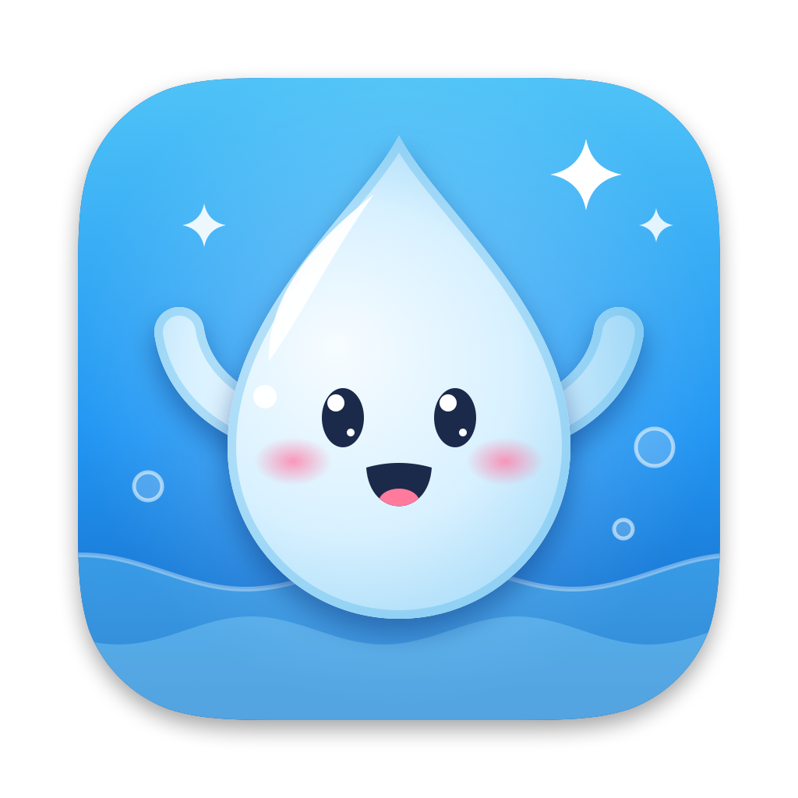

# Sip & Stretch

**A tiny macOS menu bar buddy that nudges you to drink water, stretch, rest your eyes and take walks, with way more personality than a timer should have.**

100% local · no network · no account · ~0% CPU when idle

[](https://github.com/ramamona/sip-and-stretch/actions/workflows/ci.yml)
[](LICENSE)
[](#-install)
[](https://swift.org)
[](https://buymeacoffee.com/nareshramamourthy)

</div>

---

## 📸 Screenshots

<table>
  <tr>
    <td align="center" rowspan="2">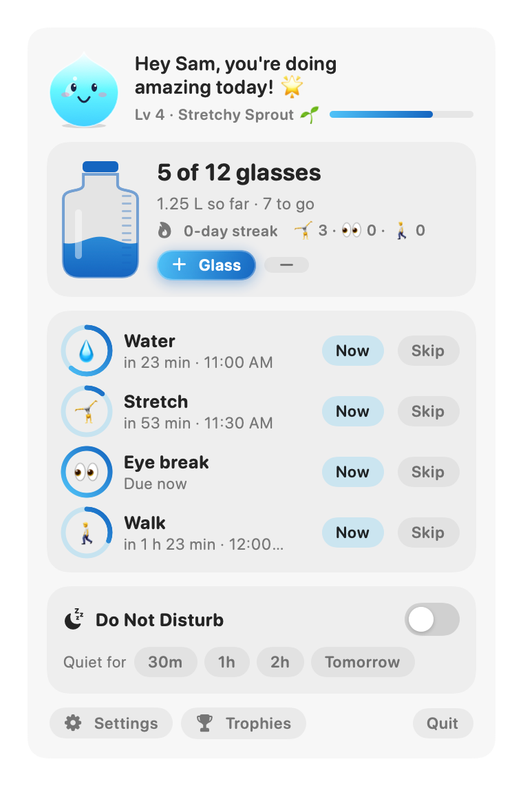<br><sub><b>Menu bar popover</b></sub></td>
    <td align="center">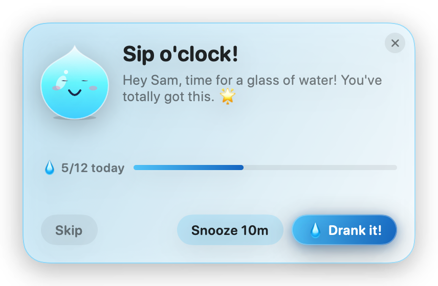<br><sub><b>Water nudge card</b></sub></td>
  </tr>
  <tr>
    <td align="center">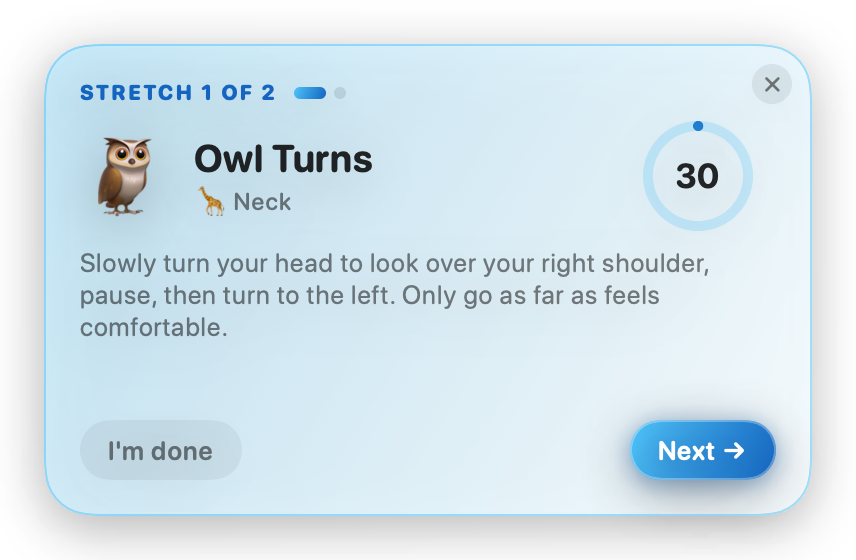<br><sub><b>Guided stretch</b></sub></td>
  </tr>
  <tr>
    <td align="center">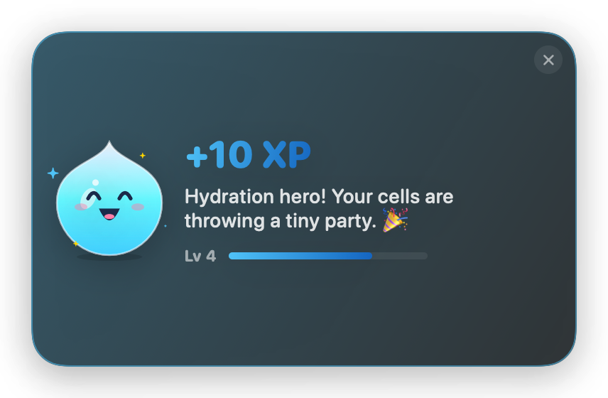<br><sub><b>Celebrations (dark mode)</b></sub></td>
    <td align="center">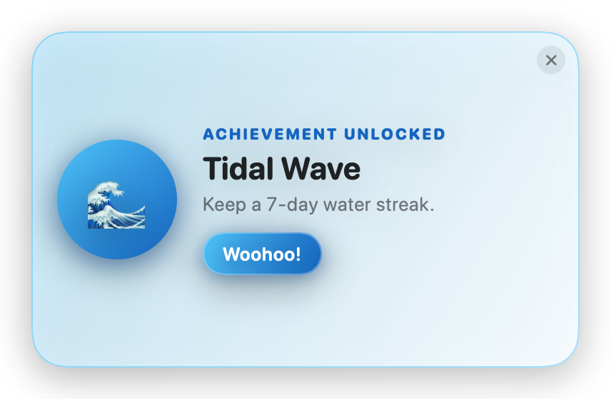<br><sub><b>Achievements</b></sub></td>
  </tr>
  <tr>
    <td align="center">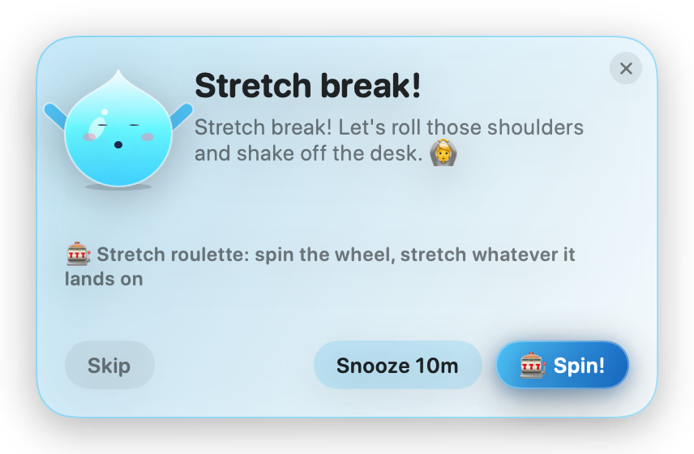<br><sub><b>Stretch roulette</b></sub></td>
    <td align="center">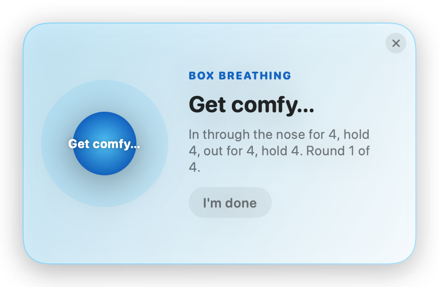<br><sub><b>Box breathing</b></sub></td>
  </tr>
  <tr>
    <td align="center">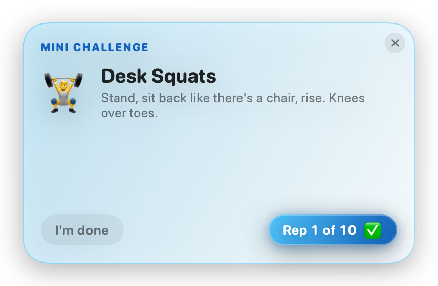<br><sub><b>Mini challenges</b></sub></td>
    <td align="center">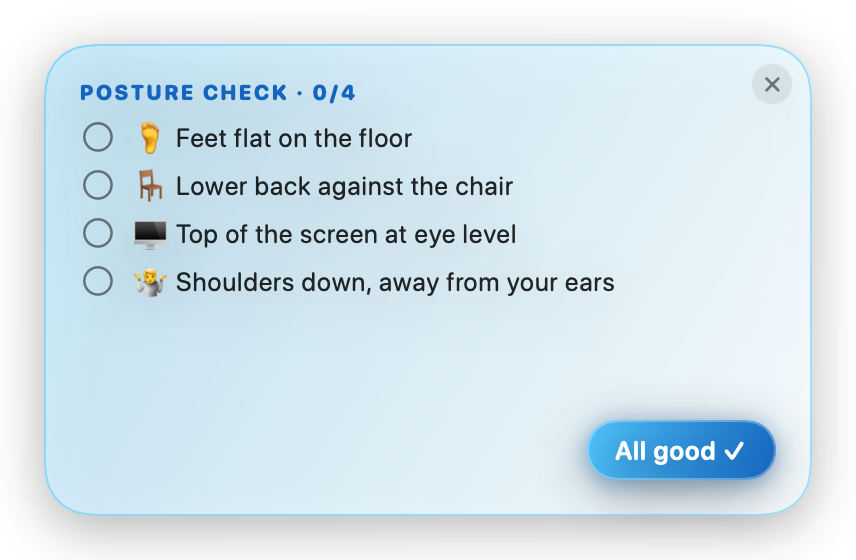<br><sub><b>Posture check</b></sub></td>
  </tr>
  <tr>
    <td align="center">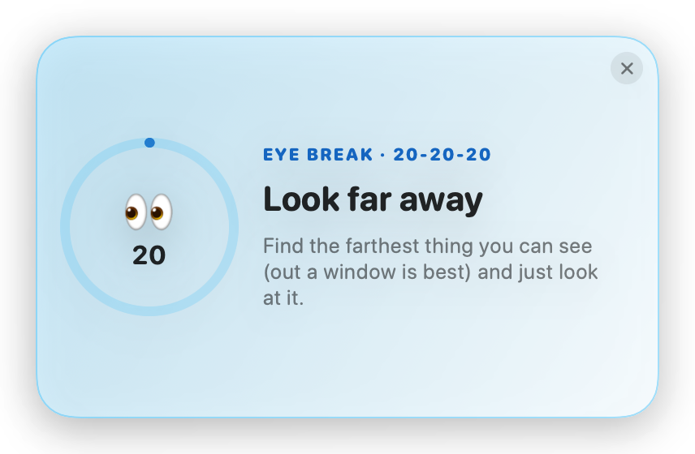<br><sub><b>Eye break (20-20-20)</b></sub></td>
    <td align="center">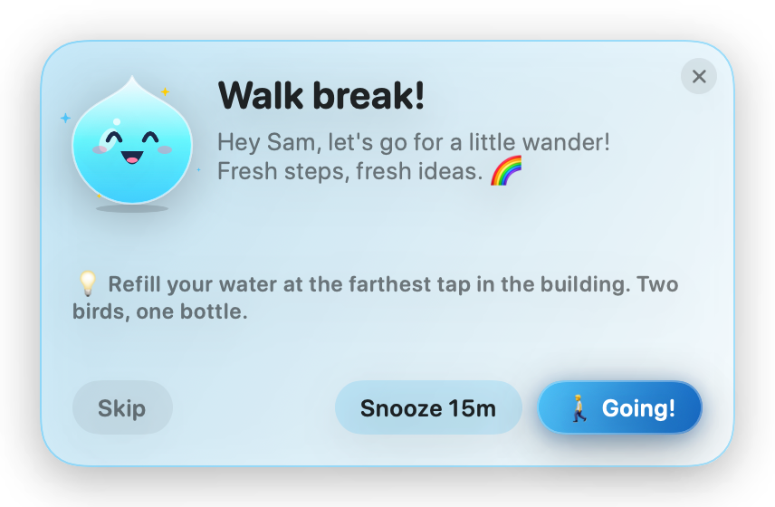<br><sub><b>Walk break</b></sub></td>
  </tr>
  <tr>
    <td align="center">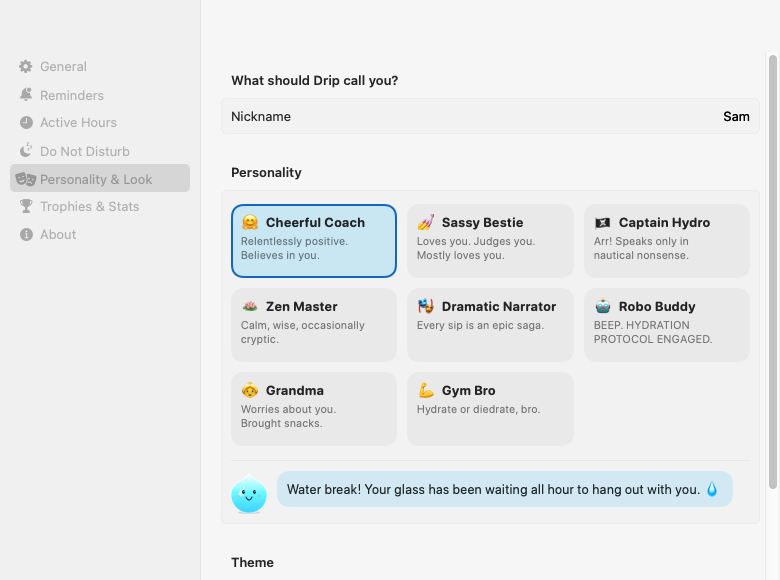<br><sub><b>Personalities &amp; themes</b></sub></td>
    <td align="center">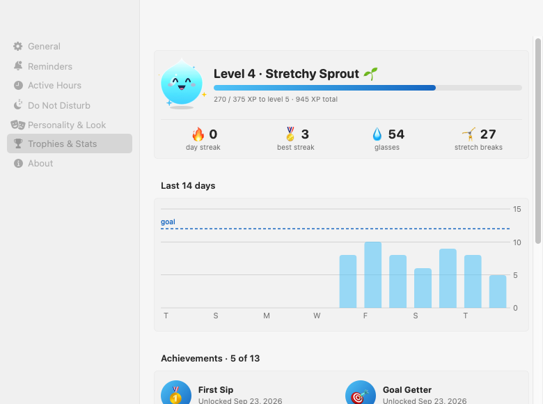<br><sub><b>Trophies &amp; stats</b></sub></td>
  </tr>
</table>

<sub>Screenshots are generated from the real app with <code>make snapshots</code>.</sub>

## Why?

You open your laptop at 9, blink, and it's 4pm. Your water bottle is still full, your neck has fossilized, and your spine is shaped like a question mark.

Most reminder apps fire a boring notification that you swipe away without reading. Sip & Stretch gives you **Drip**, a small water droplet with a face and moods, who shows up on a friendly card, walks you through desk stretches (or a breathing exercise, a mini challenge, a posture check, a spin of the stretch roulette…), reminds you to rest your eyes and go for a walk, cheers when you drink, and gets a bit sleepy when you turn on Do Not Disturb. It also stays quiet when you're **on a call**, after hours, or away from your desk.

It's free, open source, 100% local, and small enough to read in an afternoon.

## ✨ Features

### 💧 Meet Drip
- A cute droplet mascot whose **mood follows your day**: happy, excited, sleepy (during Do Not Disturb), thirsty (when you're behind on water) and stretching.
- **8 personalities** pick how Drip talks to you, and messages can use your nickname:

  | | Personality | | Personality |
  |---|---|---|---|
  | 🤗 | Cheerful Coach | 🎭 | Dramatic Narrator |
  | 💅 | Sassy Bestie | 🤖 | Robo Buddy |
  | 🏴‍☠️ | Captain Hydro (pirate) | 👵 | Grandma |
  | 🪷 | Zen Master | 💪 | Gym Bro |

- **5 themes** (accent colors): Ocean, Sunset, Mint, Grape, Bubblegum.

### 🧭 Menu bar popover
- Drip with a greeting in your chosen personality, your **level and XP bar**.
- An **animated water bottle** that fills as you drink (glasses today vs. goal, in ml or oz), with **+1 / -1 glass** buttons.
- Streak flame 🔥 and today's stretch breaks, eye breaks and walks.
- **Countdown rings** for every reminder that's on, each with **Now** and **Skip**.
- A Do Not Disturb toggle with presets, Settings, and Quit.
- The menu bar item itself can show **just the icon**, a **countdown** to the next reminder, or **water progress** (like `3/8`). It turns into a 🌙 moon while DND is on, and a 🎥 camera while you're on a call.

### 🃏 Nudge cards
- Custom **floating, animated cards** slide in at the screen corner you choose (or center stage), and they **never take keyboard focus**, so a reminder can't eat what you're typing.
- **Water card:** Drank it! · Snooze · Skip.
- **Stretch card:** every break is one of five formats, so they never get stale (pick which ones you like):
  - 🧘 **Guided stretches:** 1–5 stretches from a library of 30, each with instructions and a countdown ring that moves on by itself.
  - 🎰 **Stretch roulette:** a wheel of body areas spins and lands on today's target.
  - 🫁 **Box breathing:** a circle breathes with you, 4-4-4-4, for four rounds.
  - 💪 **Mini challenges:** 10 desk squats, a 30-second wall sit, secret glute squeezes… Tap once per rep.
  - 🪑 **Posture check:** tick off feet, back, screen height and shoulders as you fix them.
- **Eye card (20-20-20):** every 20 minutes, look about 6 m (20 ft) away while the card counts down 20 seconds.
- **Walk card:** every 2 hours, with an idea for where to go ("refill your water at the farthest tap").
- Every break ends with confetti 🎉 and XP.
- If several reminders come due together, they **queue up** instead of piling on top of each other.

### 🔔 Delivery, sounds and voice
- Choose **Nudge card**, **macOS system notification** (with actionable *Drank it* / *Done* / *Snooze* buttons), or **both**.
- If notification permission is denied, Sip & Stretch **falls back to cards** so you never miss a nudge.
- Pick **any macOS system sound** per reminder (or none), with preview.
- Optional **read reminders aloud** (speech).

### ⏰ Time-restricted reminders and Do Not Disturb
- **Active hours:** set a start and end time and the weekdays you work. Overnight windows like `22:00–02:00` work too. Outside the window, reminders sleep.
- **Do Not Disturb:** 30 min · 1 h · 2 h · until tomorrow · until turned off. Anything that comes due during DND waits and turns into a single **catch-up nudge** about a minute after DND ends. DND survives restarts.
- **Pause for meetings:** while any app is using your camera or microphone (Zoom, Teams, Meet, FaceTime…), reminders wait and any card on screen tucks itself away, so nothing pops up during a screen share. Drip only checks whether they're in use. It never sees or hears anything, and there's no permission prompt.
- **Smart away detection:** when the screen locks, the Mac sleeps, or you've been idle for a few minutes, reminders hold. Walking away resets the stretch, eye and walk timers, and a held water reminder shows up shortly after you're back.

### 🏆 Gamification
- **XP:** +10 per glass, +15 per stretch break, +5 per eye break, +20 per walk.
- **Levels** with silly titles, from *Dusty Cactus* 🌵 all the way to *Ocean Overlord* 🌊.
- **Daily water-goal streak.** Days outside your active weekdays don't break it.
- **14-day history chart** and confetti.
- **13 achievements:**

  | Achievement | How to unlock |
  |---|---|
  | First Sip | Log your first glass |
  | Goal Getter | Hit your daily water goal |
  | On Fire | 3-day streak |
  | Tidal Wave | 7-day streak |
  | Hydration Legend | 30-day streak |
  | Bendy | 10 stretch breaks |
  | Noodle Mode | 100 stretch breaks |
  | Early Bird | A glass before 8 am |
  | Perfect Day | Water goal + 5 stretch breaks in one day |
  | Centurion | 100 glasses |
  | Hawk Eyes | 50 eye breaks |
  | Wanderer | 25 walks |
  | Snooze Button Champion | Snooze 25 times (we see you 👀) |

### 🛠 And also
- **Launch at login** (via `SMAppService`).
- **Accessibility:** honors *Reduce Motion* (Drip and the bottle hold still, cards fade instead of sliding, no confetti), VoiceOver announces new cards, and custom controls have proper labels.
- **URL scheme automation** for Shortcuts and scripts (see [Automation](#-automation-with-the-url-scheme)).
- **Private by design:** no network, no analytics, no account.
- **Light on resources:** about 0% CPU and ~17 MB of memory while idle. It ticks every 30 s with timer coalescing, animations run only while you're looking at them, and the Settings window is freed when you close it.

## 📦 Install

1. Download the latest `SipStretch-<version>.zip` from [**Releases**](https://github.com/ramamona/sip-and-stretch/releases).
2. Unzip it and drag **SipStretch.app** into `/Applications`.
3. Open it. Drip appears in your menu bar (there's no Dock icon, that's on purpose).

> [!NOTE]
> Releases built with the maintainer's Developer ID are **signed and notarized by Apple** and open normally. (How that works: [docs/RELEASING.md](docs/RELEASING.md).)
>
> **Got an ad-hoc build and Gatekeeper says it can't be opened?** That happens with builds made without the signing secrets, like forks and CI artifacts. Pick one:
> - **macOS 14:** right-click (or Control-click) the app → **Open** → **Open**.
> - **macOS 15 and later:** try to open it once, then go to **System Settings → Privacy & Security** and click **Open Anyway**.
> - **Terminal:** `xattr -dr com.apple.quarantine /Applications/SipStretch.app`
>
> You only need to do this once. Want to know exactly what you're running? [Build it yourself](#-build-from-source), it takes about a minute.

## 🔨 Build from source

**Requirements**

- macOS 14 Sonoma or later
- Xcode 16+ **or** just the Command Line Tools with Swift 6 (`xcode-select --install`)

No Xcode project, no dependencies. It's a plain Swift package.

```bash
git clone https://github.com/ramamona/sip-and-stretch.git
cd sip-and-stretch

make run       # build SipStretch.app and launch it
make install   # copy it to /Applications
make test      # run the unit tests
```

> [!NOTE]
> Only have the Command Line Tools? Everything works, including `make test`, which adds the swift-testing plugin path the CLT leave out. One rule for contributors: use `@ViewState` instead of SwiftUI's `@State` (see [CONTRIBUTING.md](CONTRIBUTING.md#code-style)).

> [!TIP]
> `swift run` works for quick UI hacking, but system notifications, launch at login and the `sipstretch://` URL scheme only work from a real `.app` bundle. Prefer `make run`, which builds `build/SipStretch.app` and opens it.

All `make` targets are listed in [CONTRIBUTING.md](CONTRIBUTING.md#make-targets).

## 🧑‍🏫 Usage guide

### The menu bar
Click Drip (or the countdown / `3/8` next to it) to open the popover. From there you can log a glass (+1), undo one (-1), fire a reminder right now, skip the next one, flip Do Not Disturb, or open Settings.

### Nudge cards
When a reminder is due, a card slides in at your chosen corner.

- **Water:** *Drank it!* logs a glass and gives you XP. *Snooze* brings the card back after your snooze length. *Skip* lets this one go and starts the countdown to the next.
- **Stretch:** the main button starts whichever format came up: *Let's stretch*, *Spin!*, *Breathe*, *I'm in* or *Check me*.
- **Eyes:** *Start* runs a 20-second countdown while you look far away. It finishes by itself.
- **Walk:** *Going!* logs the walk. Take the idea on the card, or wander wherever you like.

Cards never become the focused window, so keep typing: nothing you type goes to a card. Answer with the mouse or trackpad.

**Swipe to dismiss**, just like a notification banner: flick a card toward the screen edge with a two-finger trackpad swipe, or drag it with the mouse. A short swipe snaps back. Swiping away counts the same as **×**.

During a guided stretch, *I'm done* ends the routine early and still counts the break. Closing the card with **×** during the first stretch counts as a skip.

On first launch Drip says hi with a welcome card that has a shortcut to Settings.

### Do Not Disturb
Turn it on from the popover (or [by URL](#-automation-with-the-url-scheme)) with a preset:

| Preset | Ends |
|---|---|
| 30 min / 1 h / 2 h | after that long |
| Until tomorrow | when your next active-hours window starts |
| Until turned off | when you turn it off |

While DND is on the menu bar shows a 🌙 and Drip gets sleepy. Reminders that come due in the meantime aren't lost. You get one catch-up nudge about a minute after DND ends.

### Active hours (time-restricted reminders)
Reminders only fire inside your active window, on your active weekdays. Outside it they sleep, and when your day starts the countdown **restarts**, so the first reminder lands **one interval after the window opens**, not the second you sit down.

> **Example:** active hours are Mon–Fri, 09:00–18:00, with water and stretch every 60 minutes (the defaults).
> - Monday 09:00: the window opens and both countdowns restart.
> - Around 10:00: first water nudge. The first stretch comes about half an hour later, so the two don't collide.
> - Monday 18:00: reminders go to sleep for the night.
> - Saturday and Sunday: nothing. Your streak doesn't break either.
>
> Night owl? A window like `22:00–02:00` crosses midnight and works as you'd expect: glasses after midnight still count towards the session that started the evening before, so your streak stays intact.

### Away detection
Sip & Stretch notices when you're not there:

- the screen is **locked**,
- the Mac is **asleep**, or
- you've been **idle** for N minutes (default 5).

While you're away reminders hold. When you come back, the **stretch, eye and walk timers reset** (you were already moving and looking at something else) and any **water reminder that was held fires shortly after you return**.

### Meetings
While any app uses the camera or a microphone, Drip treats you as "on a call": reminders wait, any card on screen tucks away, and the menu bar shows 🎥. About a minute after the call ends, anything that came due shows up as a catch-up. Turn it off under **Settings → Active Hours → Meetings**. Heads-up: some apps keep the mic open all the time (voice chat apps, dictation), which counts as a call too.

## 🤖 Automation with the URL scheme

Everything below works from Terminal, scripts, Raycast/Alfred, or the **Open URLs** action in the Shortcuts app.

| URL | What it does |
|---|---|
| `sipstretch://drink` | Log one glass of water |
| `sipstretch://undo-drink` | Remove the last glass |
| `sipstretch://remind/water` | Show the water reminder now |
| `sipstretch://remind/stretch` | Show the stretch reminder now |
| `sipstretch://remind/eyes` | Show the eye-break reminder now |
| `sipstretch://remind/walk` | Show the walk reminder now |
| `sipstretch://dnd?minutes=60` | Do Not Disturb for N minutes |
| `sipstretch://dnd/on` | Do Not Disturb until turned off |
| `sipstretch://dnd/off` | Turn Do Not Disturb off |
| `sipstretch://settings` | Open Settings |

```bash
# Heads-down for 90 minutes
open "sipstretch://dnd?minutes=90"

# Log a glass from a script or a keyboard shortcut
open "sipstretch://drink"
```

**Shortcuts:** add an **Open URLs** action with any URL above. Put it in a Shortcut you trigger from the menu bar or a keyboard shortcut, or in an automation (for example, "when my Focus turns on, open `sipstretch://dnd/on`").

## ⚙️ Customization

Everything lives in **Settings** (from the popover, or `sipstretch://settings`).

| Setting | Default | Options |
|---|---|---|
| Water reminder | On, every **60 min** | 10 min – 4 h |
| Stretch reminder | On, every **60 min** (first one staggered **30 min** after water) | 10 min – 4 h |
| Eye break (20-20-20) | On, every **20 min**, snooze 5 min | 10 min – 4 h |
| Walk reminder | On, every **2 h**, snooze 15 min | 10 min – 4 h |
| Stretch formats | all five | Guided, Roulette, Box breathing, Mini challenge, Posture check |
| Snooze length | **10 min** | 5, 10, 15, 20 or 30 min, per reminder |
| Reminder sound | Water **Bottle**, Stretch **Purr**, Eyes **Tink**, Walk **Hero** | any macOS system sound or none, with preview |
| Read reminders aloud | Off | On / Off |
| Daily water goal | **3 L** (12 glasses of 250 ml) | 0.5 – 6 L in 250 ml steps |
| Glass size | **250 ml** | presets from 150 to 500 ml |
| Units | ml | ml / oz |
| Stretches per break | **2** | 1 – 5 |
| Stretch focus areas | all | neck, shoulders, back, wrists, legs, eyes |
| Only remind during active hours | On | On / Off (around the clock) |
| Active hours | **09:00 – 18:00** | any start/end, overnight windows allowed |
| Active weekdays | **Mon – Fri** | any days |
| Pause during calls | On | On / Off (camera or mic in use) |
| Pause when I'm away | On | On / Off (lock and sleep always pause) |
| Away threshold (idle) | **5 min** | 1 – 60 min without keyboard or mouse |
| Delivery | **Nudge card** | Nudge card / System notification / Card + notification |
| Card position | **Top right** | any of the four corners, or Center stage |
| Personality | **Cheerful Coach** 🤗 | 8 personalities |
| Nickname | *(empty, Drip says "friend")* | anything |
| Theme | **Ocean** | Ocean, Sunset, Mint, Grape, Bubblegum |
| Menu bar display | **Countdown** | Icon only / Countdown / Water progress |
| Launch at login | Off | On / Off |

## 🗂 Project structure

```
sip-and-stretch/
├── Package.swift                     # SwiftPM manifest: SipStretchCore, SipStretch, SipStretchCoreTests
├── Makefile                          # build / test / app / run / install / zip / icon / snapshots / clean
├── Sources/
│   ├── SipStretchCore/               # Pure logic, no UI imports, fully unit tested
│   │   ├── ReminderKind.swift        # water vs. stretch
│   │   ├── Settings.swift            # every user setting + defaults (Codable)
│   │   ├── ActiveSchedule.swift      # active hours & weekdays, overnight windows
│   │   ├── DoNotDisturb.swift        # DND state and presets
│   │   ├── ReminderClock.swift       # the scheduler: when is each reminder due? (pure tick function)
│   │   ├── Stats.swift               # glasses, stretches, XP, levels, streaks, history
│   │   ├── Achievements.swift        # the 11 achievements and their unlock rules
│   │   ├── Personality.swift         # the 8 personalities + MessagePack type
│   │   ├── Messages.swift            # every line each personality can say
│   │   ├── Messages+Breaks.swift     # eye-break and walk lines
│   │   ├── Breaks.swift              # stretch formats, challenges, walk ideas, BreakPlanner
│   │   ├── Stretches.swift           # Stretch, BodyArea, and the picker
│   │   ├── StretchLibrary+Data.swift # the stretch catalogue
│   │   └── AutomationCommand.swift   # parsing sipstretch:// URLs
│   └── SipStretch/                   # The menu bar app (SwiftUI + AppKit)
│       ├── App/                      # entry point, AppModel (source of truth), app delegate (URL events), persistence
│       ├── Services/                 # notifications, sound/speech, presence, meeting detector, login item
│       ├── Nudge/                    # floating cards, their queue, and the break activities (roulette, breathing…)
│       ├── Views/                    # menu bar label and popover
│       │   ├── Components/           # Drip mascot, water bottle, rings, confetti, button styles, @ViewState
│       │   └── Settings/             # the Settings window and its panes
│       └── Dev/                      # --snapshots mode that renders docs/screenshots
├── Tests/
│   └── SipStretchCoreTests/          # swift-testing tests for SipStretchCore
├── Support/                          # Info.plist, AppIcon.icns
├── scripts/                          # bundle.sh (assembles + signs the .app), notarize.sh, make-icon.swift
└── docs/                             # RELEASING.md (signing & notarization), icon.png, screenshots/
```

## 🏗 Architecture

The app is split in two:

- **`SipStretchCore`** is a plain Swift library with no UI imports. All the decisions live here: when a reminder is due, how DND and active hours interact, XP, streaks, achievements, and what Drip says. `ReminderClock.tick` is a **pure function**: it takes the current time and state and returns the new state plus which reminders fire. That makes the tricky time math easy to test.
- **`SipStretch`** is the app. `AppModel` is an `@Observable`, `@MainActor` class and the **single source of truth**. A timer calls into the clock, and when something fires, the model hands it to the delivery layer. State is saved as JSON in `UserDefaults`.

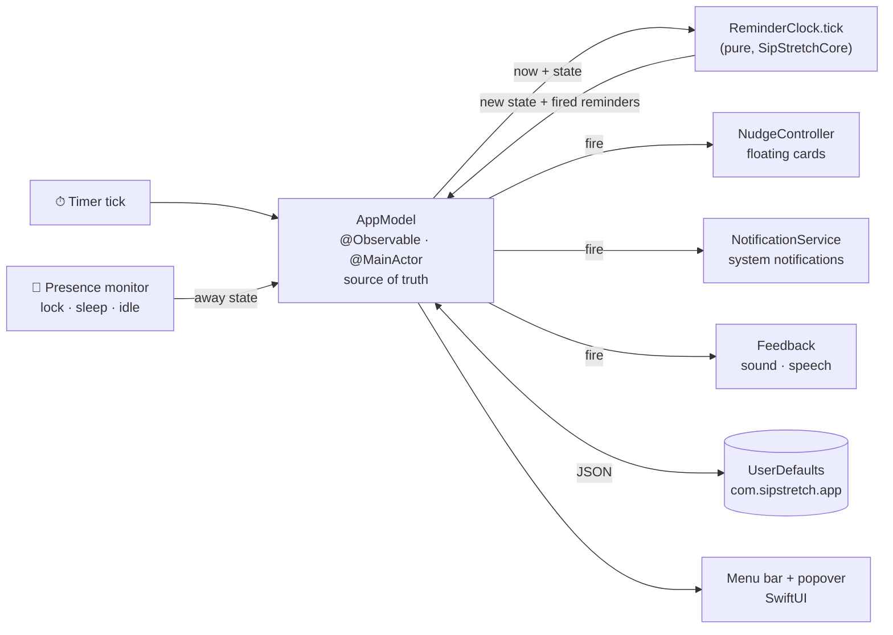

## 🤝 Contributing

Contributions are very welcome, whether that's code, stretches, jokes, or translations. Start with [CONTRIBUTING.md](CONTRIBUTING.md) and please follow the [Code of Conduct](CODE_OF_CONDUCT.md).

Good first issues:

- 🎭 **Add a personality.** One enum case and one pack of lines. There's an [issue template](.github/ISSUE_TEMPLATE/idea_personality.yml) for pitching one.
- 🧘 **Add a stretch** to the library.
- 🎨 **Add a theme.**
- 🌍 **Translate** Drip into your language.

## 🗺 Roadmap

These are **ideas, not promises**. Pick one up if it sparks joy.

- 🌍 Localization
- ⚡️ App Intents / native Shortcuts actions
- ➕ Custom reminders (eye breaks, posture checks, …)
- ❤️ Log water to Apple Health
- ☁️ iCloud sync between Macs
- 🧩 Widgets
- 🍺 Homebrew cask
- ✅ Notarized builds

## ❓ FAQ

**Why a menu bar app?**
Reminders should stay out of the way until they're needed. There's no Dock icon and no window to manage. Drip sits in the menu bar and comes out when it's time.

**Does it work with macOS Focus?**
Not directly. Sip & Stretch has its own Do Not Disturb. To link the two, create a Shortcuts automation for your Focus that opens `sipstretch://dnd/on` when it turns on and `sipstretch://dnd/off` when it turns off (if your macOS version offers Focus automations).

**I'm not getting system notifications.**
Check **System Settings → Notifications → Sip & Stretch** and make sure notifications are allowed. Or switch **Delivery** to *Nudge card*, which needs no permission. If permission is denied, the app falls back to cards anyway. Also make sure you're running the bundled app (`make run` or the release), not `swift run`.

**Where is my data?**
Only on your Mac, in `UserDefaults` under `com.sipstretch.app`, stored as small JSON blobs. To peek at them:

```bash
defaults export com.sipstretch.app /tmp/sip.plist && /usr/libexec/PlistBuddy -c 'Print :stats.v1' /tmp/sip.plist
```

To start fresh, quit the app and run `defaults delete com.sipstretch.app`.

**How do I uninstall?**
Quit it, turn off *Launch at login* first if you enabled it, delete `/Applications/SipStretch.app`, and optionally run `defaults delete com.sipstretch.app`.

## 🔒 Privacy

Sip & Stretch is **100% local**. It makes no network requests, has no analytics or telemetry, and has no accounts. Your settings and stats stay in `UserDefaults` on your Mac. See [SECURITY.md](SECURITY.md) to report a security issue.

## ⚕️ Health disclaimer

Sip & Stretch is a friendly nudge, **not medical advice**. The stretches are gentle desk stretches: move slowly, stay within a comfortable range, and **stop if anything hurts**. If you have a medical condition, an injury, or specific hydration needs, talk to a healthcare professional and set your goals with them.

## ☕ Support

Sip & Stretch is free and always will be. If Drip saved your neck (literally), you can
[**buy me a coffee**](https://buymeacoffee.com/nareshramamourthy). Or a glass of water. Drip would prefer water. 💧

<a href="https://buymeacoffee.com/nareshramamourthy"></a>

## 📄 License

[MIT](LICENSE) © 2026 Sip & Stretch contributors.

## 💙 Credits

Drip, the personalities, and the questionable jokes were built by the Sip & Stretch contributors.

<div align="center">

Made with 💧 and too many stretch breaks.

</div>
